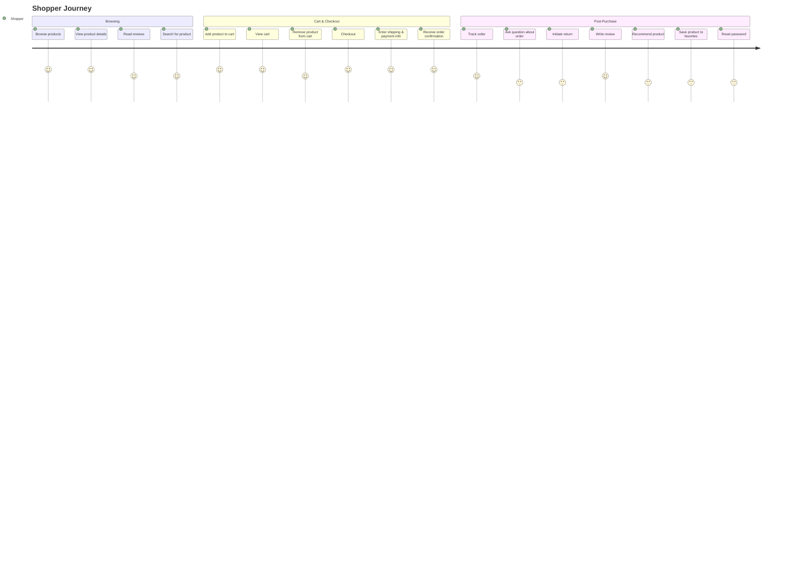
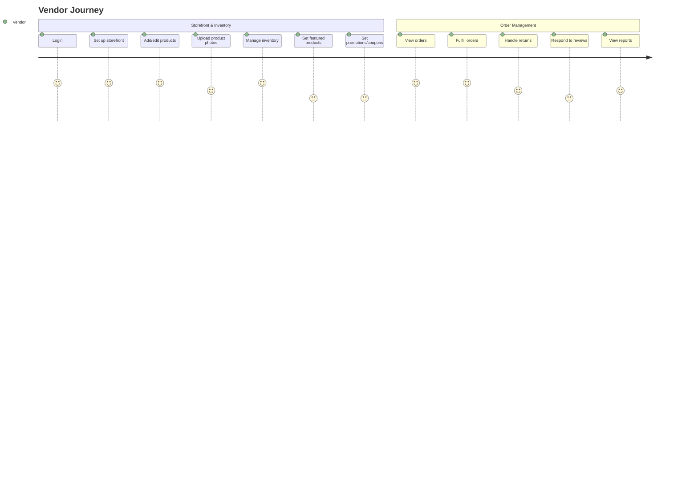
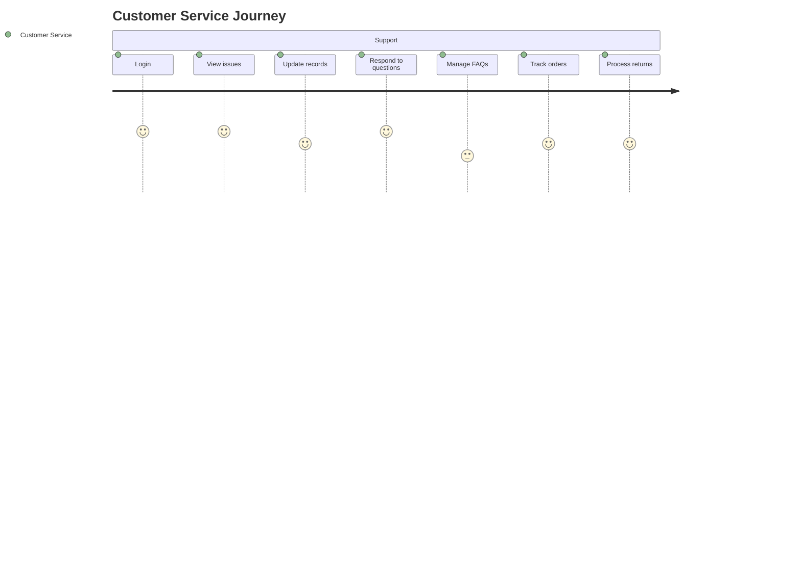
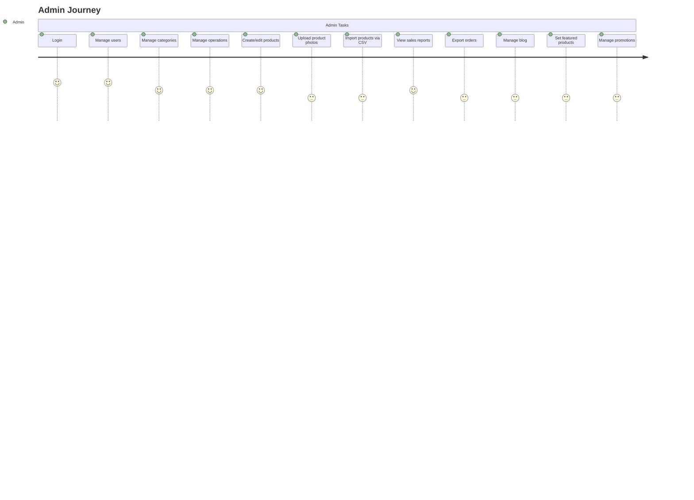

# INCEPTION.md

## Users
- **Shopper**: Adds/removes items from cart, checks out, writes reviews.
- **Vendor**: Manages inventory, fulfills orders.
- **Customer Service**: Tracks issues, updates records, manages FAQs.
- **Admin**: Manages users, categories, operations.

## Goals
- Provide gourmet farm-to-table products to gourmands
- give artisanal farmers a direct sales channel

## Risks
- inventory latency
- fulfillment issues, returns
- customer service (when Hamazon doesn't control the vendors)
- Marketing may be challenging; individual vendors? The whole Hamazon site?
- Farmers may be inexperienced with maintaining a digital storefront
- Farmers may be inexperienced with digital marketing

## User Journeys

## Epics
- **Admin Users**: Get the Admin users working on the site
- **Shoppers v1**: Allow shoppers to use the site
- **Storefront Setup**: Merchandiser should be able to set up and configure their storefront, including branding, product listings, and featured products.
- **Inventory Management**: Merchandiser should be able to manage inventory, update stock levels, and handle out-of-stock scenarios.
- **Order Management & Returns**: Merchandiser should be able to fulfill orders, process returns, and handle customer service inquiries. Shoppers should be able to initiate returns and track order status.
- **Product Variants & Catalog**: Support for product variants (e.g., size, color), bulk import, and catalog management.
- **Shopping Cart & Checkout**: Shoppers can add/remove products, view cart, and complete checkout with payment and shipping details.
- **Payment & Payment Issues**: Integration with payment gateways, handling payment failures, and secure storage of payment information.
- **Marketing & Promotions**: Merchandisers and admins can create and manage coupons, discounts, and marketing campaigns. Includes support for blog, featured products, and social sharing (e.g., Facebook app).
- **Reviews & Ratings**: Shoppers can review and rate products, and see aggregated ratings.
- **User Accounts & Authentication**: Shoppers and admins can sign up, log in, reset passwords, and manage account details.
- **Reporting & Analytics**: Admins can view sales reports, export orders, and access business analytics.
- **Mobile & External Integrations**: Support for native iPhone app, RSS/Atom feeds, and integration with automated fulfillment systems.

## User Stories
- **Admin should be able to login** (Est: 2.0, Priority: p3 - Low)
  - Admin should be a special user type. We can create the first admin user directly in the DB, but let's encrypt the password.
- **Admin should be able to create new product** (Est: 1.0, Priority: p3 - Low)
  - Product information includes title, description, price, SKU.
- **Admin should be able to upload product photo** (Est: 2.0, Priority: p3 - Low)
- **Admin should be able to upload multiple product photos and mark one as the primary** (Est: 3.0, Priority: p3 - Low)
- **Shopper should see list of products, with primary photo as thumbnail** (Est: 2.0, Priority: p3 - Low)
- **Product browsing should be paginated, with 10 products per page** (Est: 1.0, Priority: p3 - Low)
- **Make product browsing pagination AJAXy** (Est: 2.0, Priority: p3 - Low)
- **Admin should be able to import multiple new products from CSV file** (Est: 3.0, Priority: p3 - Low)
- **Shopper should be able to click on a product, and see all product details, including photos** (Est: 1.0, Priority: p3 - Low)
- **Shopper should be able to add product to shopping cart** (Est: 1.0, Priority: p3 - Low)
- **Shopper should be able to recommend a product to a friend** (Est: 1.0, Priority: p3 - Low)
  - Prompt for email address and personalized message, send email with product details and message
- **Shopper should be able to view contents of shopping cart** (Est: 2.0, Priority: p3 - Low)
  - Cart icon in top right corner, with a number indicating how many items in cart
- **Shopper should be able to remove product from shopping cart** (Est: 1.0, Priority: p3 - Low)
- **Cart manipulation should be AJAXy** (Est: 1.0, Priority: p3 - Low)
- **Shopper should be able to search for product** (Est: 3.0, Priority: p3 - Low)
  - One search field, search should look through product name, description, and SKU
- **Shopper should be able to enter credit card information and shipping address** (Est: 1.0, Priority: p3 - Low)
- **When shopper submits order, authorize total product amount from payment gateway** (Est: 3.0, Priority: p3 - Low)
- **If system fails to authorize payment amount, display error message to shopper** (Est: 1.0, Priority: p3 - Low)
- **If authorization is successful, show order number and confirmation message to shopper** (Est: 1.0, Priority: p3 - Low)
- **Send notification email of order placement to admin** (Est: 1.0, Priority: p3 - Low)
- **Shopper should be able to check status of order by entering name and order number** (Est: 2.0, Priority: p3 - Low)
- **Shopper should be able to ask question about order** (Est: 1.0, Priority: p3 - Low)
  - When checking status of order, shopper should have the option to ask a question. This should send email to admin.
- **Admin can review all order questions and send responses to shoppers** (Est: 1.0, Priority: p3 - Low)
- **Shopper should be able to sign up for an account with email address** (Est: 2.0, Priority: p3 - Low)
- **Shopper should be able to reset forgotten password** (Est: 1.0, Priority: p3 - Low)
- **Shopper should be able to log out** (Est: 1.0, Priority: p3 - Low)
- **When checking out, shopper should have the option to sign in to their account** (Est: 1.0, Priority: p3 - Low)
- **Signed in shopper should be able to review order history** (Est: 1.0, Priority: p3 - Low)
  - Show orders in last 60 days, with link to show older orders
- **Signed in shopper should be able to save credit card and address information used in checkout** (Est: 2.0, Priority: p3 - Low)
  - Credit card numbers should be stored encrypted
- **Signed in shopper should be able to save product to favorites** (Est: 1.0, Priority: p3 - Low)
- **Signed in shopper should be able to review and remove product from favorites** (Est: 1.0, Priority: p3 - Low)
- **Apply styling to all shopper facing parts of the site, based on assets from designer** (Est: 3.0, Priority: p3 - Low)
- **Signed in shopper should be able to post product reviews** (Est: 2.0, Priority: p3 - Low)
- **Signed in shopper should be able to rate product, by choosing 1-5 stars** (Est: 1.0, Priority: p3 - Low)
- **When shopper is browsing products, show average product rating and number of reviews next to each product** (Est: 1.0, Priority: p3 - Low)
- **Shopper should be able to read reviews for a product** (Est: 1.0, Priority: p3 - Low)
- **Admin should be able to mark a product as featured** (Est: nan, Priority: p3 - Low)
- **Featured products should appear on the site landing page** (Est: nan, Priority: p3 - Low)
- **Admin should be able to create and edit blog articles** (Est: nan, Priority: p3 - Low)
- **Admin should be able to save blog articles in draft mode** (Est: nan, Priority: p3 - Low)
- **Published blog articles should appear on the site** (Est: nan, Priority: p3 - Low)
- **People should be able to subscribe to blog via RSS and Atom** (Est: nan, Priority: p3 - Low)
- **Admin should be able to view monthly sales report** (Est: nan, Priority: p3 - Low)
- **Admin should be able to export orders as CSV file, based on date range and order status** (Est: nan, Priority: p3 - Low)
- **Integrate with automated order fullfillment system** (Est: nan, Priority: p3 - Low)
- **native iPhone app to allow product browsing and checkout** (Est: nan, Priority: p3 - Low)
- **Facebook app, allowing users to share favorite products** (Est: nan, Priority: p3 - Low)